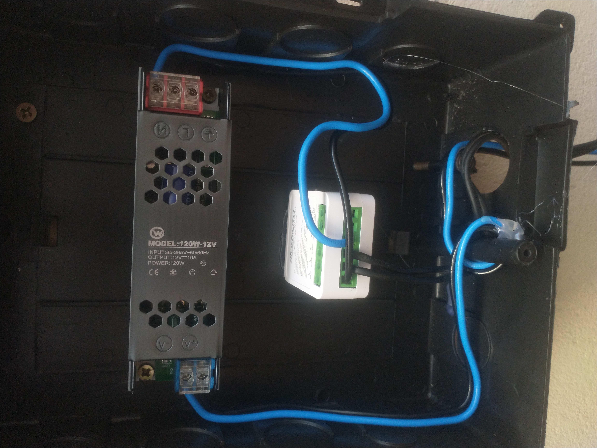
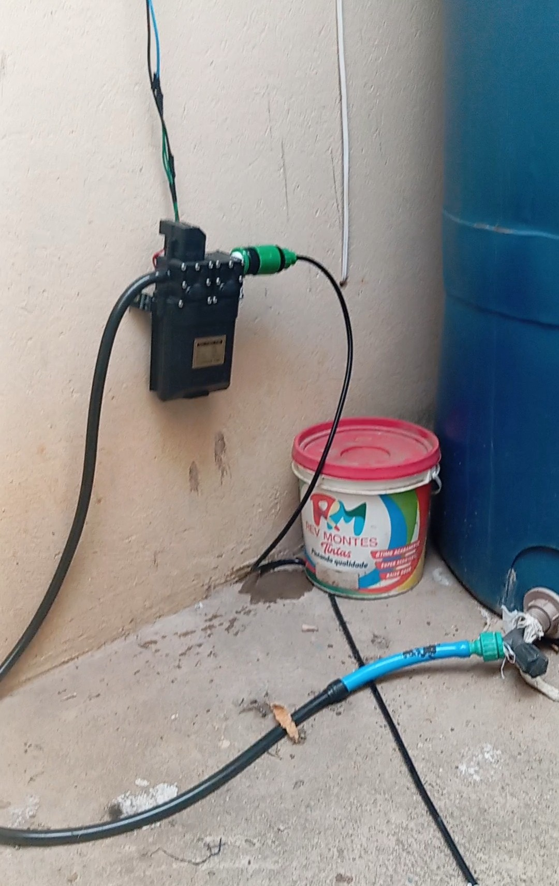
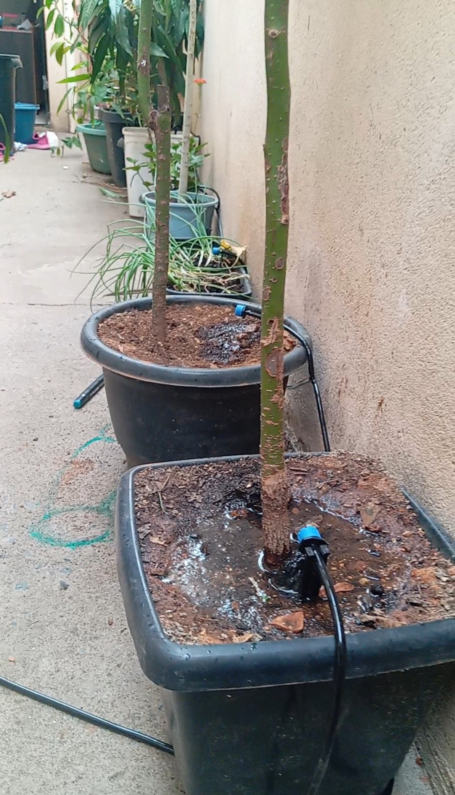
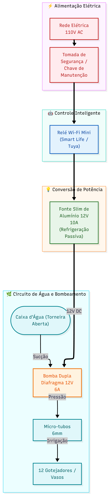

# 🪴 Irrigador Inteligente IoT
### *Smart Irrigation Hub & Automation System*

---

  <b>Engenharia DIY de baixo custo e alta eficiência para irrigação automática de 12 vasos de plantas.</b> 
  Um projeto focado em zero desperdício de água, acionamento por inteligência de voz via Alexa, proteção elétrica com refrigeração passiva e arquitetura expansível para Home Assistant e ESP32.

[📌 Visão Geral](#visao-geral) •
[🎬 Vídeo](#video) •
[🛠️ Hardware](#hardware) •
[🤖 Automação](#automacao) •
[📸 Galeria](#galeria) •
[📐 Diagrama](#diagrama) •
[🚀 Roadmap](#roadmap)

---

 

  
 

---

## 🎬 Demonstração em Vídeo no YouTube

Clique na imagem abaixo para ver a demonstração completa do sistema em funcionamento:

*<b>Irrigação Automática Fácil e Barata: Para Você que Não Tem Tempo de Molhar as Plantas!</b>*

 

## 📌 Visão Geral do Projeto

> [!IMPORTANT]
> 🎯 **O Propósito e a Escalabilidade do Sistema**
> Este projeto foi desenvolvido para resolver um problema real e cotidiano: **a falta de tempo e o cansaço acumulado da rotina**. Seja para quem mora na cidade e não consegue manter as plantas cuidadas, ou para quem possui uma horta em um sítio e sofre com a distância e a dificuldade de monitoramento constante. 
> 
> O grande diferencial desta arquitetura é a **escalabilidade**: a mesma lógica inteligente de automação de baixo custo aplicada nestes 12 vasos pode ser expandida para o campo, bastando dimensionar componentes de maior potência (como bombas agrícolas e contactoras) para distribuição em larga escala.

<table>
  <tr>
    <td width="50%">
      <h3>💧 Precisão Hidráulica</h3>
      
Micro-dosagem direcionada diretamente às raízes através de <b>12 gotejadores ajustáveis</b> conectados por micro-tubos de 6mm, eliminando o desperdício por evaporação ou escorrimento superficial.

    </td>
    <td width="50%">
      <h3>⚡ Segurança Elétrica Reforçada</h3>
      
Alimentação por <b>fonte chaveada Slim de alumínio (12V 10A)</b> com dissipação de calor passiva, seccionada por tomada física e chave de manutenção para operação rápida e segura.

    </td>
  </tr>
  <tr>
    <td width="50%">
      <h3>🗣️ Rotina Inteligente por Voz e Clima</h3>
      
Integração total ao ecossistema Alexa para <b>checagem prévia da previsão do tempo</b>, envio de notificações no smartphone e feedback por voz antes e depois da rega.

    </td>
    <td width="50%">
      <h3>🛠️ Arquitetura Acessível & Aberta</h3>
      
Construído com componentes modulares de fácil acesso, otimizado para operação em nuvem (Smart Life/Tuya) e estruturado para futura migração local via <b>ESP32 e Home Assistant (CasaOS)</b>.

    </td>
  </tr>
</table>

---

## 🛠️ Especificações Técnicas de Hardware

| Componente | Categoria | Especificação Técnica | Função Operacional no Sistema |
| :--- | :---: | :--- | :--- |
| **Bomba de Água** | Hidráulica | Mini Dupla Diafragma (12V DC / 6A) | Sucção da água da caixa e pressurização para a rede |
| **Fonte de Alimentação** | Elétrica | Chaveada Slim Alumínio (12V DC / 10A) | Conversão 110V/12V com refrigeração passiva |
| **Relé Inteligente** | Automação | Módulo Mini Smart (Smart Life / Tuya) | Comutação da rede elétrica controlada via Wi-Fi |
| **Chave de Manutenção** | Segurança | Tomada Física + Chave de Seccionamento | Isolamento elétrico manual instantâneo do sistema |
| **Rede de Distribuição** | Hidráulica | Micro-tubos 6mm + 12 Gotejadores | Condução e rega localizada direta no solo dos vasos |
| **Reservatório** | Reservatório | Caixa d'Água (Linha de Pressão) | Abastecimento contínuo e gravitacional para a bomba |

 

---

## 🤖 Fluxo Explicativo da Automação

> [!NOTE]  
> A irrigação ocorre em um ciclo diário automatizado de **exatos 60 segundos**, alinhando controle elétrico e confirmação sonora.

* 🕒 **09:00 — Análise Meteorológica:** A Alexa consulta o serviço de clima e verifica a probabilidade de chuva do dia.
* 🗣️ **09:00 — Alerta Sonoro:** A caixa Echo emite o aviso: *"Vou molhar as plantas do corredor agora às 9 horas"*.
* ⚡ **09:00 — Acionamento Elétrico:** O Relé Wi-Fi chaveia a alimentação de 110V para a Fonte Slim de 12V.
* 💧 **09:00 às 09:01 — Rega Pressurizada:** A bomba de diafragma opera por 60 segundos alimentando a rede de 12 gotejadores.
* ✅ **09:01 — Finalização Segura:** O relé corta a energia da fonte e a Alexa confirma: *"Acabei de regar as plantas e desliguei a água"*.

 

---

## 📸 Galeria Visual do Projeto

| ⚡ Painel Elétrico & Fonte | 💧 Bomba & Linha de Pressão | 🌿 Vasos & Micro-Gotejadores |
| :---: | :---: | :---: |
|  |  |  |
| *Fonte Slim 12V e Relé Wi-Fi com proteção elétrica* | *Bomba Dupla Diafragma 12V 6A acoplada à tubulação* | *Rede de micro-tubos de 6mm irrigando 12 vasos* |

 

---

## 📐 Arquitetura do Sistema

 

---

## 🚀 Roadmap de Evolução

- [x] **Fase 1:** Montagem e testes do painel elétrico (Fonte Slim 12V 10A + Relé Wi-Fi + Tomada de Segurança).
- [x] **Fase 2:** Instalação da infraestrutura hidráulica (Bomba dupla diafragma, tubos 6mm e 12 gotejadores).
- [x] **Fase 3:** Configuração das rotinas de voz, checagem do clima e avisos sonoros na Alexa.
- [ ] **Fase 4 (Em breve):** Instalação de sensor capacitivo de umidade do solo para prevenção em dias chuvosos.
- [ ] **Fase 5:** Gravação de firmware **ESPHome** em placa **ESP32** para controle local.
- [ ] **Fase 6:** Migração do controle da nuvem para o **Home Assistant** hospedado no servidor **CasaOS**.

---

Desenvolvido com dedicação por **[Adanilson](https://github.com/adanilsonf10-ui)** 🚀  
*Se este projeto te ajudou ou te inspirou, considere deixar uma ⭐️ no repositório!*

